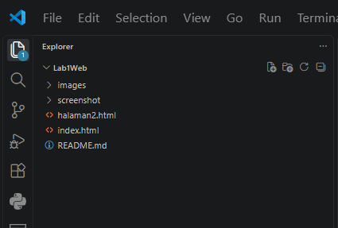
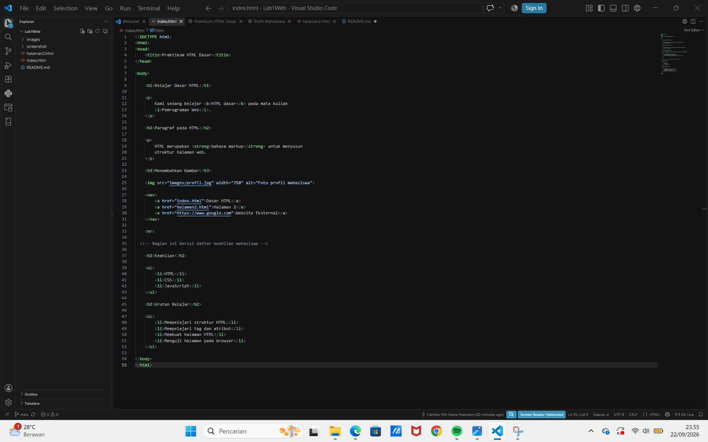
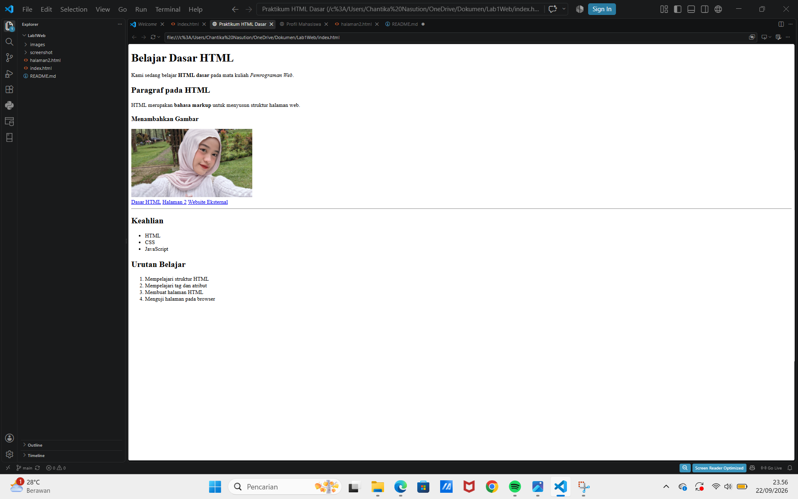
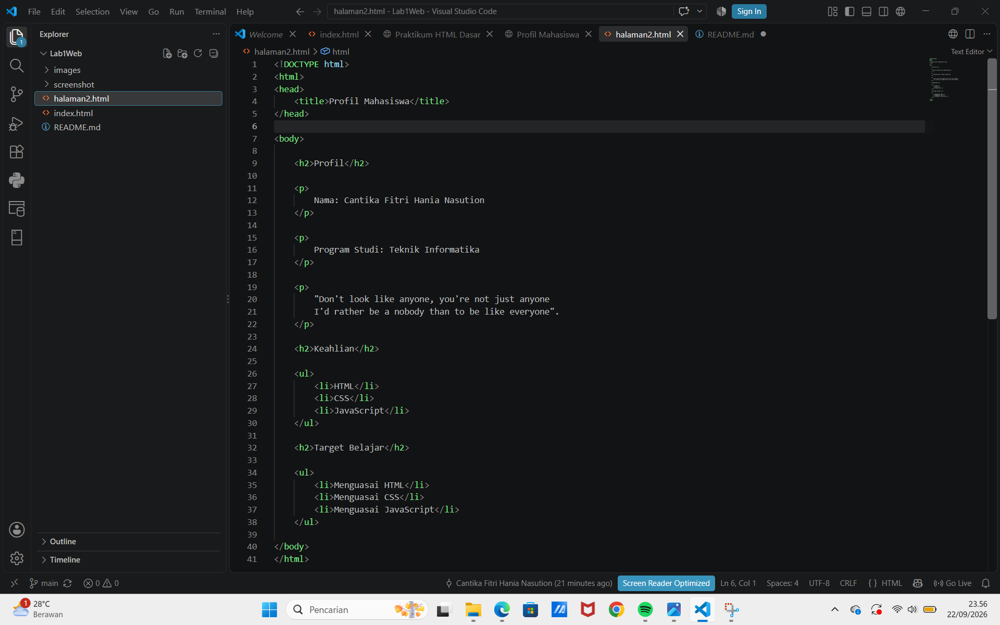
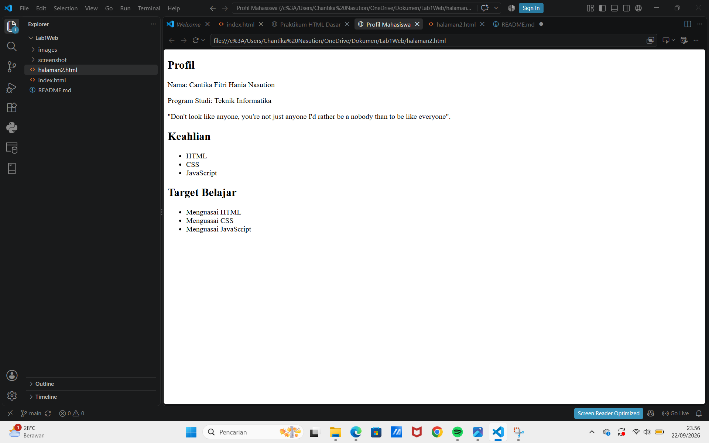
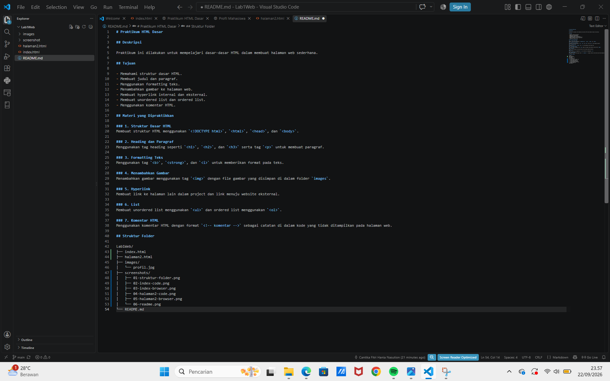

# Praktikum HTML Dasar

## Deskripsi

Praktikum ini dilakukan untuk mempelajari dasar-dasar HTML dalam membuat halaman web sederhana.

## Tujuan

- Memahami struktur dasar HTML.
- Membuat judul dan paragraf.
- Menggunakan formatting teks.
- Menambahkan gambar ke halaman web.
- Membuat hyperlink internal dan eksternal.
- Membuat unordered list dan ordered list.
- Menggunakan komentar HTML.

## Materi yang Dipraktikkan

### 1. Struktur Dasar HTML
Membuat struktur HTML menggunakan `<!DOCTYPE html>`, `<html>`, `<head>`, dan `<body>`.

### 2. Heading dan Paragraf
Menggunakan tag heading seperti `<h1>`, `<h2>`, dan `<h3>` serta tag `
` untuk membuat paragraf.

### 3. Formatting Teks
Menggunakan tag `<b>`, `<strong>`, dan `<i>` untuk memberikan format pada teks.

### 4. Menambahkan Gambar
Menambahkan gambar menggunakan tag `` dengan file gambar yang disimpan di dalam folder `images`.

### 5. Hyperlink
Membuat link ke halaman lain dalam project dan link menuju website eksternal.

### 6. List
Membuat unordered list menggunakan `<ul>` dan ordered list menggunakan `<ol>`.

### 7. Komentar HTML
Menggunakan komentar HTML dengan format `<!-- komentar -->` sebagai catatan di dalam kode yang tidak ditampilkan pada halaman web.

## Struktur Folder

Lab1Web/
├── index.html
├── halaman2.html
├── images/
│   └── profil.jpg
├── screenshots/
│   ├── 01-struktur-folder.png
│   ├── 02-index-code.png
│   ├── 03-index-browser.png
│   ├── 04-halaman2-code.png
│   ├── 05-halaman2-browser.png
│   └── 06-readme.png
└── README.md

## Dokumentasi / Screenshot

### 1. Struktur Folder

### 2. Kode index.html

### 3. Tampilan index.html

### 4. Kode halaman2.html

### 5. Tampilan halaman2.html

### 6. README
